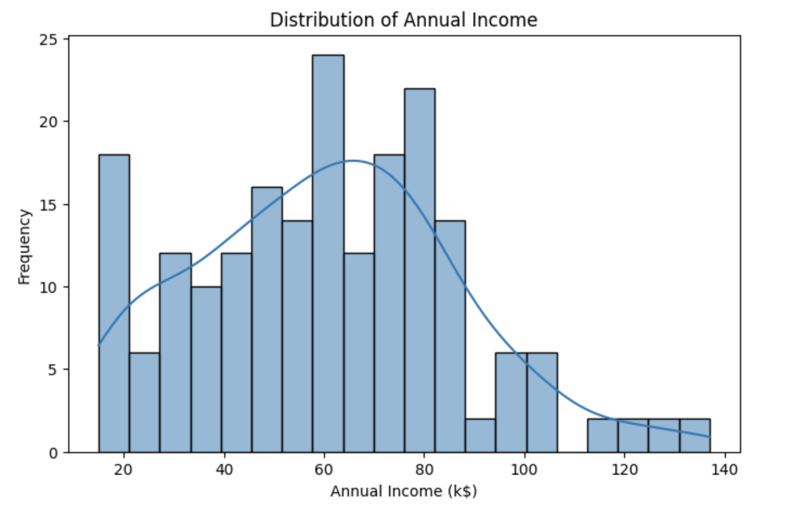
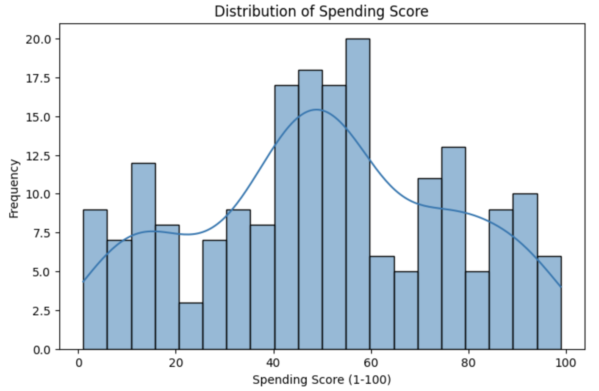
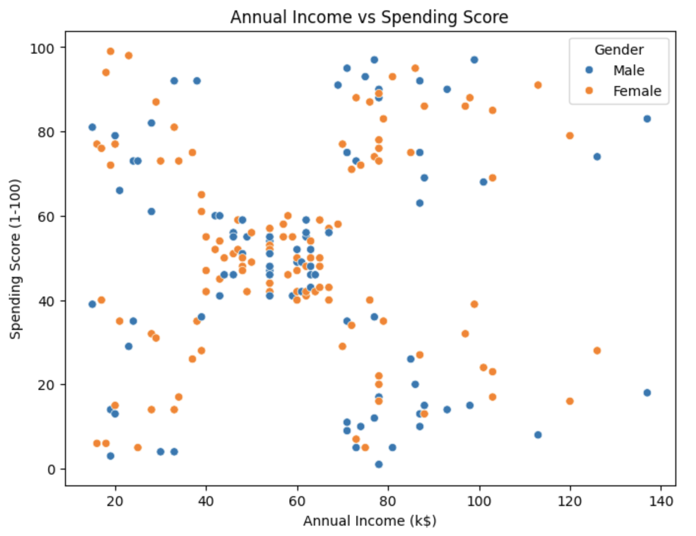
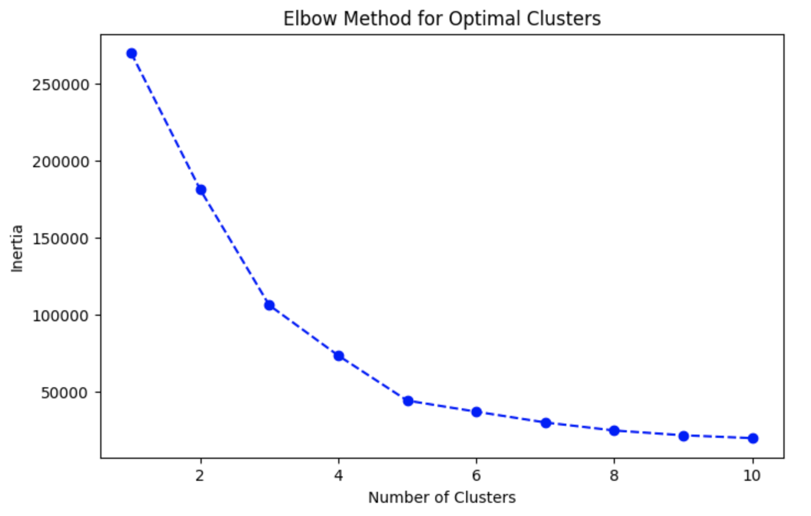
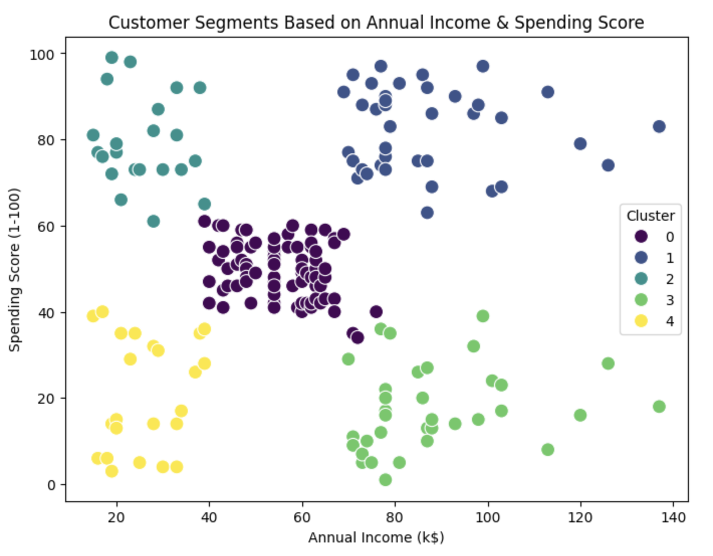

# 🛒 Customer Segmentation Using K-Means Clustering

## 📌 Objective
This project applies K-Means clustering to segment customers based on their **Annual Income** and **Spending Score**. The goal is to identify different groups of shoppers, which businesses can use for targeted marketing strategies.

## 📊 Dataset
- **Source:** Kaggle - [Customer Segmentation Dataset](https://www.kaggle.com/datasets/vjchoudhary7/customer-segmentation-tutorial-in-python)
- **Columns Used:**
  - `Annual Income (k$)`: Customer’s yearly income in thousand dollars.
  - `Spending Score (1-100)`: Score assigned based on shopping behavior.

## 🛠️ Steps
### **1. Load the Dataset**
- Read the dataset using Pandas.
- Explore basic statistics and check for missing values.

### **2. Data Preprocessing**
- No missing values were found.
- Selected `Annual Income` and `Spending Score` for clustering.

### **3. Exploratory Data Analysis**
#### 📊 **Distribution of Annual Income**

#### 📊 **Distribution of Spending Score**

#### 📊 **Annual Income vs Spending Score**

### **4. Finding Optimal Clusters (Elbow Method)**
- Used the **Elbow Method** to determine the best number of clusters.
- Plotted inertia values to identify the optimal `k`.

#### 📈 **Elbow Method Plot**

### **5. Apply K-Means Clustering**
- Applied K-Means with `k=5`.
- Assigned each customer a cluster label.

### **6. Visualizing the Clusters**
- Scatter plot to illustrate different customer segments.

#### 🎨 **Customer Segments**

## 🔍 Findings
- **Cluster 1**: Low income, low spending (budget-conscious shoppers).
- **Cluster 2**: High income, high spending (luxury shoppers).
- **Cluster 3**: Average income, average spending.
- **Cluster 4**: High income, low spending (careful spenders).
- **Cluster 5**: Low income, high spending (impulsive shoppers).

## 📂 Files in Repository
- `Mall_Customers.csv`: Original dataset.
- `customer_segments.csv`: Processed dataset with assigned clusters.
- `customer_segmentation.ipynb`: Jupyter Notebook with all code.
- `README.md`: Project overview.
- `annual_income_distribution.png`, `spending_score_distribution.png`, `income_vs_spending.png`: Distribution plots.
- `elbow_method.png`, `customer_segments.png`: Visualizations of clustering results.

## 🚀 Next Steps
- Try different clustering algorithms like **DBSCAN** or **Hierarchical Clustering**.
- Add **age and gender** to the clustering model for deeper insights.
- Build a **dashboard** to visualize customer segments interactively.

---

*Author: Andrew Jaya Satyo*  
*LinkedIn: linkedin.com/in/andrew-jaya-satyo-1501992b4*  
*Email: andrewjaya12345@gmail.com*  